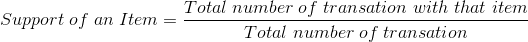
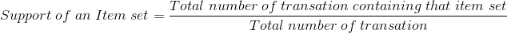
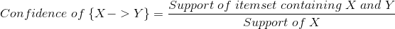
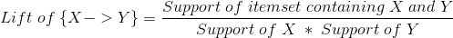
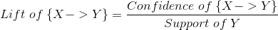

# Association Rules
Association rules analysis is a technique to uncover how items are associated to each other. 
There are three common ways to measure association. They are
1. Support
2. Confidence
3. Lift

Consider these 8 Transactions happenned in a store.

Transaction|Items
---|---
1|Apple, Beer, Rice, Chicken
2|Apple, Beer, Rice
3|Apple, Beer
4|Apple, Pear
5|Milk, Beer, Rice, Chicken
6|Milk, Beer, Rice
7|Milk, Beer
8|Milk, Pear
 
## Support
This says how popular an itemset is, as measured by the proportion of transactions in which an itemset appears.
In above table , the support of {Apple} is 4 out of 8, or 50%. Itemsets can also contain multiple items. For instance, the support of {Apple, Beer, Rice} is 2 out of 8, or 25%.

We can define support for an item set also. Let say the item set is the set of Apple and Beer, then we can write the equation as

If you discover that sales of items beyond a certain proportion tend to have a significant impact on your profits, you might consider using that proportion as your support threshold. You may then identify itemsets with support values above this threshold as significant itemsets.

## Confidence 
This says how likely item Y is purchased when item X is purchased, expressed as {X -> Y}. This is measured by the proportion of transactions with item X, in which item Y also appears. In Table, the confidence of {apple -> beer} is 3 out of 4, or 75%.

One drawback of the confidence measure is that it might misrepresent the importance of an association. This is because it only accounts for how popular apples are, but not beers. If beers are also very popular in general, there will be a higher chance that a transaction containing apples will also contain beers, thus inflating the confidence measure. To account for the base popularity of both constituent items, we use a third measure called lift.

## Lift
This says how likely item Y is purchased when item X is purchased, while controlling for how popular item Y is. In Table , the lift of {apple -> beer} is 1,which implies no association between items. A lift value greater than 1 means that item Y is likely to be bought if item X is bought, while a value less than 1 means that item Y is unlikely to be bought if item X is bought.

Lift can also be written as 

